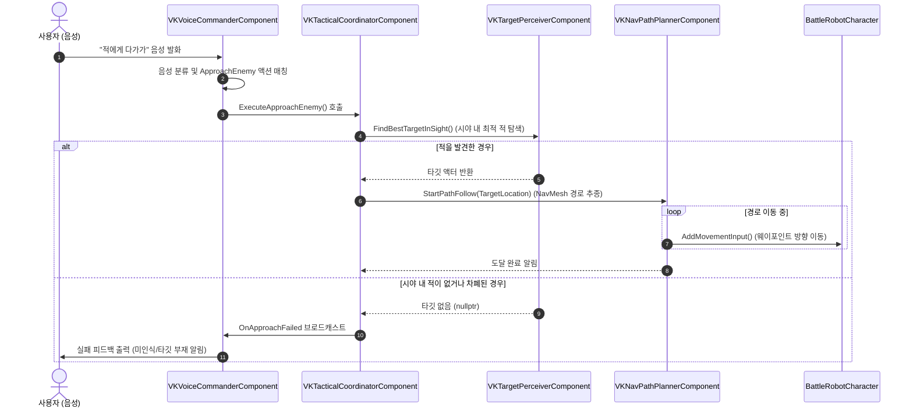

# 프로젝트 작업 기록서 (History)

**작성 일시**: 2026-09-26  
**작성 대상**: 음성 명령 기반 적 대상 추적 및 내비게이션 접근(Tactical Approach) 시스템 & 보행 제어

---

## 1. 개요 (Overview)
본 작업은 음성 명령("적에게 접근", "다가가" 등)을 인식하여, 플레이어의 시야 내 최적의 적을 인지하고 언리얼 엔진 5의 내비게이션 메시(NavMesh)를 통해 장애물을 회피하며 자동으로 접근하는 전술 이동 시스템을 구축한 내역을 기록한다. 또한, 후퇴 및 측면 이동 시 캐릭터의 시선 처리(스트레이프) 및 블렌드 스페이스(BS: Blend Space) 연동을 위한 이동 방향 연산 로직을 추가하였다.

---

## 2. 설계 원칙 (Architecture Principles)
- **ECS (Entity Component System: 엔터티 컴포넌트 시스템) 원칙 준수**
  - 모놀리식(Monolithic) 캐릭터 클래스에 모든 AI/경로 로직을 작성하지 않고, 단일 책임 원칙(SRP: Single Responsibility Principle)에 따라 컴포넌트로 기능 분할.
  - `VKTargetPerceiverComponent`: 적 인지 및 가시성 검사 전담.
  - `VKNavPathPlannerComponent`: 내비게이션 경로 탐색 및 웨이포인트 추종 전담.
  - `VKTacticalCoordinatorComponent`: 두 컴포넌트를 조율하여 상위 레벨의 전술 행동 생명주기 관리.
  - `VKVoiceCommanderComponent`: 음성 파이프라인과 게임플레이 전술 컴포넌트 간 이벤트 중계.

---

## 3. 기능 보고서 (Function Report)

| 구성 역할 (Role) | 클래스 / 파일명 | 주요 기능 및 역할 |
| :--- | :--- | :--- |
| **적 인지기 (Target Perceiver)** | `UVKTargetPerceiverComponent` (`.h` / `.cpp`) | 플레이어 시야각(FOV: 90도) 및 최대 감지 거리(2000cm) 내의 적 캐릭터를 탐색하고, 레이캐스트(Line Trace)를 통해 벽에 가려지지 않은 최적의 타깃을 선별 |
| **경로 생성기 (Nav Path Planner)** | `UVKNavPathPlannerComponent` (`.h` / `.cpp`) | `UNavigationSystemV1`을 활용해 타깃 위치까지의 실시간 경로를 생성하고, 목표 도달 판정 및 경로 실패 시 재탐색 수행 |
| **전술 조율기 (Tactical Coordinator)** | `UVKTacticalCoordinatorComponent` (`.h` / `.cpp`) | "적에게 접근(ApproachEnemy)" 명령 실행 시 인지기와 경로 생성기를 구동하고, 타깃 부재 시 `OnApproachFailed` 브로드캐스트 및 정지 제어 |
| **음성 명령 연동기 (Voice Integration)** | `UVKActionPoolComponent` `UVKVoiceCommanderComponent` | 신규 음성 액션 `ApproachEnemy` 등록 및 음성 인식 완료 시 `VKTacticalCoordinatorComponent::ExecuteApproachEnemy()` 실행 연동 |
| **캐릭터 모션 제어기 (Movement Controller)** | `ABattleRobotCharacter` (`.h` / `.cpp`) | 후퇴(`FallBack`) 또는 측면 이동 시 시선을 카메라 정면에 고정하는 스트레이프 모드(`SetStrafeMode`) 구현 및 2D 블렌드 스페이스용 이동 방향 각도 계산(`GetMovementDirection`) 제공 |
| **빌드 모듈 의존성 (Build Dependency)** | `BattleRobot.Build.cs` | 내비게이션 경로 탐색 API 호출을 위한 `NavigationSystem` 공용 모듈 의존성 추가 |

---

## 4. 흐름 보고서 (Flow Report)

---

## 5. 상세 변경 내역 (Detailed Changes)

### 5.1 신규 컴포넌트 추가
1. **`VKTargetPerceiverComponent`**
   - 멤버 변수: `mMaxPerceptionDistance`(2000.0f), `mFieldOfViewAngle`(90.0f), `mTargetChannel`(ECC_Pawn), `mTraceChannel`(ECC_Visibility)
   - 주요 함수: `FindBestTargetInSight()`, `HasLineOfSightToTarget()`
2. **`VKNavPathPlannerComponent`**
   - 멤버 변수: `mAcceptanceRadius`(150.0f), `mReplanInterval`(0.5f), `mCurrentWaypoints`
   - 주요 함수: `StartPathToLocation()`, `TickPathFollowing()`, `StopPathFollowing()`
3. **`VKTacticalCoordinatorComponent`**
   - 멤버 변수: `mTargetPerceiver`, `mNavPathPlanner`, `mOwnerCharacter`
   - 이벤트: `OnApproachFailed` (타깃 부재 시 바인딩된 음성 컴포넌트로 전달)

### 5.2 기존 시스템 확장 및 개선
1. **`BattleRobotCharacter`**
   - `mbIsStrafing`, `mbIsBackpedaling` 프로퍼티 추가.
   - `SetStrafeMode(bool)`: `bOrientRotationToMovement = false`, `bUseControllerRotationYaw = true` 토글로 카메라 정면 응시 유지.
   - `GetMovementDirection()`: 이동 속도 벡터와 제어 회전(ControlRotation) Yaw 기준 사잇각($-180^\circ \sim +180^\circ$) 계산 함수 추가.
2. **`VKVoiceCommanderComponent`**
   - `ApproachEnemy` 액션 실행 시 전술 코디네이터 구동 분기 추가.
   - 이동 액션 수행 시 방향 벡터에 따라 자동으로 스트레이프 모드 설정 및 액션 종료(`HandleActionFinished`) 시 해제 연동.
3. **`VKActionPoolComponent`**
   - `ApproachEnemy` 액션 정의 등록: "적에게 접근해", "적에게 다가가", "적에게 가", "접근해", "다가가", "approach".

---

## 6. 점검 및 후속 과제 (Next Steps)
1. **Git 스테이징 통합 커밋**
   - 현재 신규 컴포넌트(Staged)와 수정된 기존 파일(Unstaged)이 분리되어 있으므로, 하나의 완전한 피처 단위로 통합 커밋 필요.
2. **애니메이션 블루프린트(ABP) 연동**
   - `BattleRobotCharacter::GetMovementDirection()`을 ABP의 블렌드 스페이스(BS) 입력 핀에 바인딩하여 좌/우/후퇴 보행 애니메이션 자연스러운 전환 확인.
